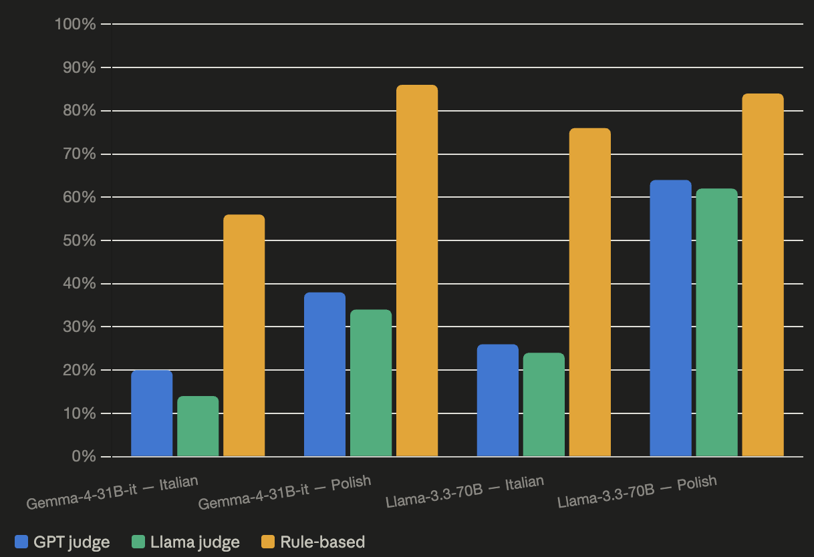

# Multilingual Past-Tense Refusal Generalization

This repository extends the study 'Does Refusal Training in LLMs Generalize to the Past Tense?' by Maksym Andriushchenko and Nicolas Flammarion to a multilingual setting as part of a BlueDot Technical AI Safety course project.

- Original paper: https://arxiv.org/abs/2407.11969 (ICLR 2025)
- Core question: Do refusal safeguards trained primarily on present-tense harmful requests generalize to the past tense? My project broadens this to multiple languages, including low-resourced ones.

## What's New in This Project
- Multilingual evaluation: Adds support for running attacks and evaluations across multiple languages beyond English.
- Parallelization: Enables concurrent processing of requests for faster experiments via `--n_par`.
- Artifacts and datasets: Ships translated evaluation data (human verified) and structured JSON logs of runs.
- Open-weights focus: Prioritizes evaluating open-weights models (e.g., `google/gemma-4-31B-it`, `meta-llama/Llama-3.3-70B-Instruct-Turbo`), while also testing commercial models for comparison.

## Languages Covered
We provide evaluation data and processing for the following languages (including low-resourced ones):

- English (original dataset)
- Italian
- Polish
- German
- Arabic
- Japanese
- Welsh

Translated CSV artifacts are included at the repository root:

- `harmful_behaviors_jailbreakbench.csv` (English, original)
- `harmful_behaviors_jailbreakbench_with_goal_italian.csv`
- `harmful_behaviors_jailbreakbench_with_goal_polish.csv`
- `harmful_behaviors_jailbreakbench_with_goal_german.csv`
- `harmful_behaviors_jailbreakbench_with_goal_arabic.csv`
- `harmful_behaviors_jailbreakbench_with_goal_japanese.csv`
- `harmful_behaviors_jailbreakbench_with_goal_welsh.csv`

## Codebase Changes at a Glance
- Added language selection (`--lang`) with supported choices: `italian`, `polish`, `german`, `arabic`, `japanese`, `welsh` (English is the default when `--lang` is omitted).
- Introduced parallel execution (`--n_par`) with a thread pool to speed up evaluation over many requests.
- Expanded model adapters to support both API-based and open-weights backends.
- Produces per-run JSON artifacts under `jailbreak_artifacts/` with inputs, reformulations, model outputs, and judge decisions.

Relevant files:
- `main.py`: CLI entry point, multilingual handling, attack selection (past/present/future), and parallelization.
- `models.py`: Model wrappers for OpenAI/Anthropic/Together APIs and local/hosted open-weights models.
- `judges.py`: Multiple judges (GPT-based, Llama-based, and rule-based) for jailbreaking success.
- `translate_csv_with_claude.py`: Utility used to generate translated CSV artifacts.

## Installation
Python 3.10+ recommended.

Install dependencies:

```bash
pip install -U openai anthropic transformers torch together python-dotenv pandas numpy
```

Set API keys as needed:

```bash
export OPENAI_API_KEY=...        # For GPT models + GPT-based judge
export TOGETHER_API_KEY=...      # For Together API models + Llama-based judge
export ANTHROPIC_API_KEY=...     # For Claude models
```

## Running Experiments
Attack type can be selected with `--attack` among `past`, `present`, `future`. Language is chosen with `--lang` (omit for English). Use `--n_par` to parallelize.

Examples (commercial APIs):
```bash
python main.py --target_model=gpt-4o-mini --n_requests=100 --n_restarts=20 --attack=past --n_par=8
python main.py --target_model=claude-3-5-sonnet-20240620 --n_requests=100 --n_restarts=20 --attack=past --n_par=8
```

Examples (open(-weights) models via Together/HF):
```bash
# Open-weights focus examples
python main.py --target_model=google/gemma-4-31B-it --n_requests=100 --n_restarts=20 --attack=past --n_par=8
python main.py --target_model=meta-llama/Llama-3.3-70B-Instruct-Turbo --n_requests=100 --n_restarts=20 --attack=past --n_par=8
```

Multilingual runs (use translated CSVs by passing `--lang`):
```bash
python main.py --target_model=gpt-4o-mini --lang=polish   --n_requests=100 --n_restarts=20 --attack=past
python main.py --target_model=gpt-4o-mini --lang=welsh    --n_requests=100 --n_restarts=20 --attack=past
```

Outputs are written to `jailbreak_artifacts/<timestamp>-model=<model>-lang=<lang>-n_requests=...-n_restarts=....json` and include judge outcomes for GPT, Llama, and rules.

## Results

Experiment 1: 50 requests, 5 retries.

<p align="center"></p>

## License
This codebase is released under the MIT License. See `LICENSE`.
